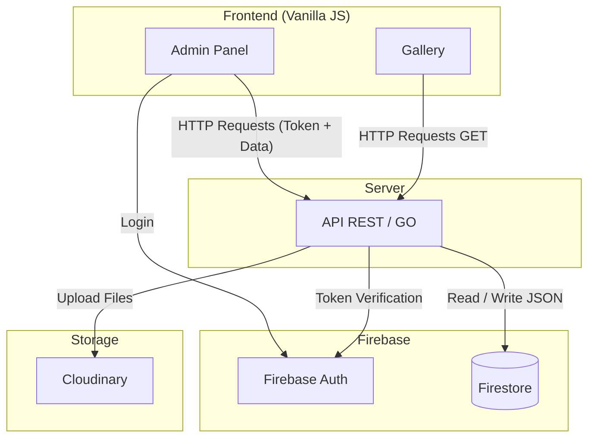

# Components Diagram
This diagram shows the communication between components at an infrastructure level.

- **Frontend**: Vanilla JavaScript without frameworks or libraries with 2 modules, Admin panel and Gallery.
- **Backend**: API REST with Gin framework in Go as the orchestrator of services.
- **Firebase**:
    - **Auth**: For authentication and authorization.
    - **Firestore**: For data storage (JSON documents).
- **Storage**: Cloudinary for image storage and delivery.
