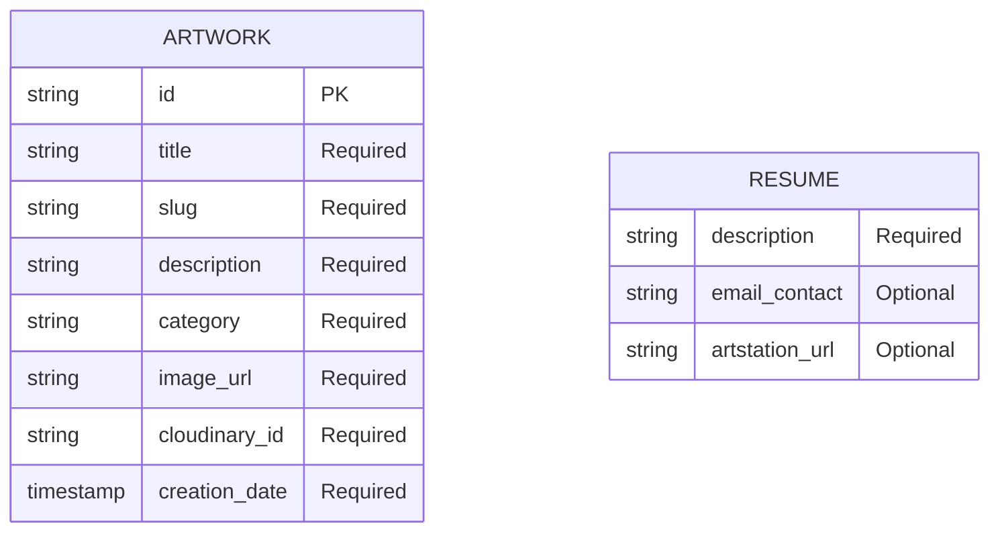

# Data Model Diagram 
This diagram illustrates the core entities of the project, detailing the specific attributes required for each one

**ARTWORK**
Composed of the essential text fields to display the art. A category field is included to allow grouping artworks by projects or types in the future.

- **slug**: URL-friendly version of the title, used for clean, shareable routing and SEO.
- **image_url**: Required to render the specific image in the frontend gallery.
- **cloudinary_id**: Crucial for triggering physical file deletion via the Cloudinary API, keeping the storage clean and avoiding orphaned files.
- **creation_date**: Serves as metadata and will be used for sorting the gallery chronologically.

**RESUME**
Contains the fundamental fields needed to display a clean and professional resume section without hardcoding the text into the HTML.